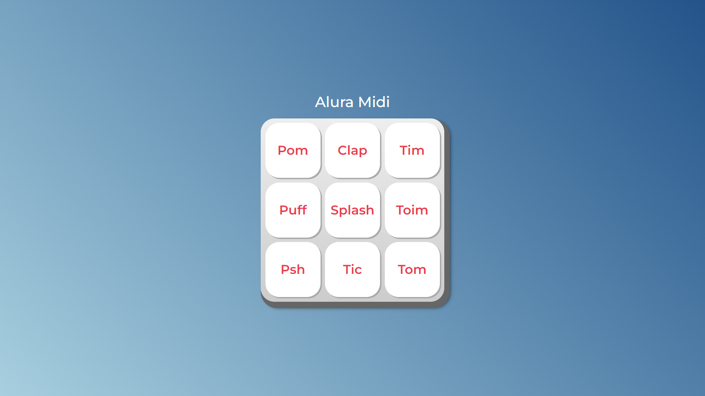

<h1 align="center"> Aura Midi </h1>

Projeto Alura Midi desenvolvido na Alura 

  <a href="#-tecnologias">Tecnologias</a>&nbsp;&nbsp;&nbsp;|&nbsp;&nbsp;&nbsp;
  <a href="#-projeto">Projeto</a>&nbsp;&nbsp;&nbsp;|&nbsp;&nbsp;&nbsp;
  <a href="#-deploy">Deploy</a>&nbsp;&nbsp;&nbsp;|&nbsp;&nbsp;&nbsp;

  

 

  

## 🚀 Tecnologias

Esse projeto foi desenvolvido com as seguintes tecnologias:

- HTML 
- CSS
- JavaScript
- Git e Github

## 💻 Projeto

Projeto elaborado durante o curso de JavaScript, com o intuito de criar uma página que reproduzisse os sons de instrumentos musicais. Esta iniciativa visa aplicar os conceitos básicos e avançados aprendidos ao longo do curso, demonstrando habilidades na implementação de funcionalidades interativas e na manipulação dinâmica do conteúdo da web.

## 🚀 Deploy
- [Acesse o projeto finalizado, online](https://rudyfernandes.github.io/aluramidi/)

